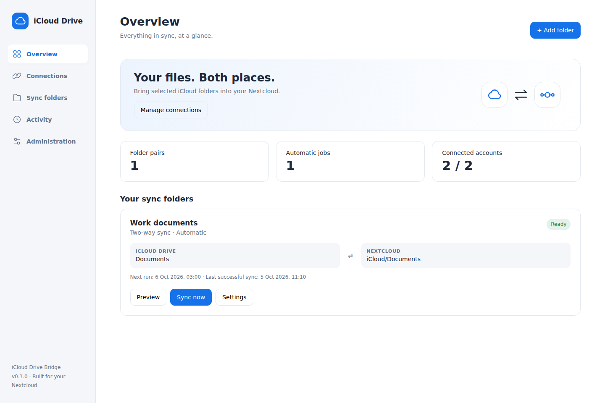

# iCloud Drive Bridge for Nextcloud

[Deutsch](README.de.md) · [Installation](#installation-with-an-existing-docker-nextcloud) · [Settings](#folder-settings) · [Troubleshooting](#troubleshooting)

Browse Apple iCloud Drive from Nextcloud and synchronize selected folder pairs on a daily or interval schedule. A native Nextcloud app provides the interface; a private Docker worker uses rclone for Apple authentication and file operations.

**Version 0.1.0 is an initial experimental release.** The iCloud backend itself is classified as experimental by rclone. Real Apple login and Advanced Data Protection behavior depend on your account and require a first-run test. No Apple credentials are included in this repository. This project is not affiliated with Apple, Nextcloud or rclone.



The image shows the shipped interface with deterministic test data, not an authenticated Apple account.

## What it does

| Feature | Behavior |
|---|---|
| Native Nextcloud interface | Overview, account connections, folder jobs, activity and administrator setup |
| English and German UI | Follows the Nextcloud document language |
| Folder picker | Browse existing iCloud and Nextcloud folders; create Nextcloud destination folders |
| Two-way synchronization | rclone `bisync`, including changes and deletions on either side |
| One-way import | rclone `copy` from iCloud to Nextcloud, without propagating source deletions |
| One-way export | rclone `copy` from Nextcloud to iCloud, without propagating source deletions |
| Scheduling | Manual, selected weekdays at a local time, or an interval of 60–10,080 minutes |
| Preview | Dry run with a separate copy of the bisync working state |
| Protection | Access-check files, deletion percentage limit, non-overlapping folder mappings |
| Conflicts | Preserve both versions, or choose a preferred version while keeping a conflict copy |
| Backups | Archive overwritten/deleted versions outside synchronized folders |
| Progress and history | Live transfer statistics, stop requests, logs and the last 100 runs per user |
| Live browsing | Authenticated, read-only WebDAV mount for Nextcloud External storage |
| Multiple users | API ownership is bound to the logged-in Nextcloud user; separate remote names and mappings |

## Architecture

The browser talks only to authenticated Nextcloud OCS routes. Nextcloud forwards permitted requests to the worker using a service token and a server-selected user identity. The worker owns scheduling, SQLite metadata, encrypted credentials, rclone configuration and transfer processes.

Transfers use Nextcloud's regular WebDAV interface. The worker never needs access to the Nextcloud data directory, database, Docker socket or host filesystem. Files written through WebDAV are processed through Nextcloud's normal file interface. The worker's timer runs independently of Nextcloud's AJAX or cron background-job mode.

For live browsing, a separate read-only rclone WebDAV process is started on loopback for each active user. A gateway on the worker validates that user's mount credentials before forwarding requests. Apple files remain in iCloud; the gateway uses a bounded, temporary VFS cache. To edit files, use a synchronized Nextcloud folder.

## Requirements and compatibility

- Existing Nextcloud with PHP 8.1 or newer. App metadata targets Nextcloud **30–35**. The CI smoke-test matrix covers 30, 34 and 35; other versions within the declared range still need installation testing.
- Docker Engine and the Docker Compose plugin on Linux for the worker.
- Python 3 on the host for generating secrets. No Python packages are needed on the host.
- An Apple account with iCloud Drive and two-factor authentication.
- Outbound HTTPS/DNS access from the worker to Apple, and connectivity to your Nextcloud WebDAV URL.
- An existing Docker network reachable by Nextcloud and the worker, or a private worker address reachable from a non-Docker Nextcloud.
- Sufficient Nextcloud quota for synchronized copies and backup files.

The frontend is shipped as plain JavaScript/CSS. You do **not** need Node, npm, Composer, FUSE, privileged containers, or a frontend build to install the app. The Dockerfile pins rclone to **1.75.1** and Python to the 3.12 image series. Runtime data and secrets are separate from Git.

## Installation with an existing Docker Nextcloud

### 1. Clone the project

```bash
sudo install -d -o "$(id -u)" -g "$(id -g)" /mnt/docker/compose/Nextcloud-iCloudDrive
git clone https://github.com/Baodor/Nextcloud-iCloudDrive.git /mnt/docker/compose/Nextcloud-iCloudDrive
cd /mnt/docker/compose/Nextcloud-iCloudDrive
cp .env.example .env
```

Find the actual Nextcloud application container and its networks:

```bash
docker ps --format 'table {{.Names}}\t{{.Image}}'
docker inspect NEXTCLOUD_CONTAINER --format '{{range $name, $network := .NetworkSettings.Networks}}{{println $name}}{{end}}'
```

Replace `NEXTCLOUD_CONTAINER` with your application container, not its database, Redis, cron or AIO master container. Edit `.env`:

```dotenv
NEXTCLOUD_URL=https://cloud.example.com
NEXTCLOUD_NETWORK=your_existing_docker_network
TZ=Europe/Berlin
BRIDGE_MAX_DAV_USERS=20
```

`NEXTCLOUD_URL` is the Nextcloud base URL, including an installation subdirectory if applicable. The worker appends `/remote.php/dav/files/LOGIN_ID/`. It must reach this address without an interactive reverse-proxy/SSO sign-in page. Authenticate to Nextcloud using its app password. Internal HTTP is supported for a trusted Docker network; use HTTPS across other networks.

The supplied network is external: Compose does not create it and does not attach your existing Nextcloud container automatically. The service's Docker DNS name is `icloud-bridge`.

### 2. Generate secrets and start the service

```bash
python3 scripts/init-secrets.py
sudo chown -R 10001:10001 secrets
docker compose config --quiet
docker compose up -d --build
docker compose ps
docker compose logs --tail=50 icloud-bridge
```

The secrets script keeps existing keys. Do not regenerate the encryption key after saving credentials. The directory is restricted to its owner; Docker bind-mounts the individual secret files for UID 10001. The service runs as that UID, drops Linux capabilities and has a read-only root filesystem. The `/data` named volume is writable and persistent.

**Back up the `secrets` directory together with the Compose data volume.** The encryption key is required to restore the encrypted configuration and account credentials. Losing the key means reconnecting accounts; retain the bisync state and inspect the folders before reinitializing anything.

### 3. Install the Nextcloud app

For automatic installation and service configuration after the worker is healthy:

```bash
bash scripts/setup-nextcloud-app.sh NEXTCLOUD_CONTAINER
```

This runs the installer, enables External storage, and stores the existing API token encrypted through Nextcloud's crypto service. It reads `secrets/api_token` using sudo when needed and does not display it. The service URL defaults to `http://icloud-bridge:8080`; override it with `BRIDGE_WORKER_URL`. `BRIDGE_API_TOKEN_FILE` selects an existing token file. After this command, continue at step 5. The path/user overrides described below also apply.

For installation with manual administrator configuration instead:

```bash
bash scripts/install-nextcloud-app.sh NEXTCLOUD_CONTAINER
```

The installer detects official Nextcloud and common LinuxServer paths, the PHP service user, and the configured writable app directory. It copies the app with the required folder name `icloud_drive`, preserves an existing app directory temporarily, then runs `occ app:enable icloud_drive`. App files are restored if enabling fails.

For a custom container layout, set overrides explicitly:

```bash
NEXTCLOUD_ROOT=/var/www/html \
NEXTCLOUD_APP_DIR=/var/www/html/custom_apps \
NEXTCLOUD_USER=www-data \
bash scripts/install-nextcloud-app.sh NEXTCLOUD_CONTAINER
```

The selected app directory should be backed by persistent storage. Otherwise reinstall the app after replacing the Nextcloud container. The installer prints the temporary backup location; that backup disappears when its container is replaced.

### 4. Connect Nextcloud to the worker

Open **iCloud Drive → Administration** as a Nextcloud administrator.

- Internal service URL: `http://icloud-bridge:8080`
- API token: the contents of `secrets/api_token`

To read the token locally after assigning the directory to the container user:

```bash
sudo cat secrets/api_token
```

Paste it into the administrator form and save. Do not paste the token into issues, screenshots or chat logs. The admin form stores it encrypted using Nextcloud's crypto service. You may leave the field empty on subsequent saves to preserve the token. Ordinary users cannot change this service connection or retrieve the service token.

### 5. Connect your two accounts

In **Connections**:

1. Enter your Apple account and its **regular password**. Apple app-specific passwords are not accepted by this rclone backend.
2. Follow the Apple challenge displayed by the app, typically a six-digit code from a trusted device. When offered, enter `sms` to request an SMS challenge. Further verification questions are shown as returned by rclone.
3. Under Nextcloud **Personal settings → Security**, create an app password, e.g. `iCloud Drive Bridge`.
4. Enter the actual Nextcloud login ID and that app password into the Nextcloud connection form. A display name is not necessarily the login ID; this matters with OIDC/LDAP accounts.

The initial Apple challenge session expires after 15 minutes. Start again if it expires. The Apple trust token is documented as valid for about 30 days; plan to renew the Apple login periodically. An upcoming-renewal banner appears during the final seven days of that estimated period. Actual expiration can occur earlier.

For Advanced Data Protection, enable **Access iCloud Data on the Web** and approve any Apple prompt on a trusted device. Support comes from the pinned rclone backend; successful sign-in alone does not prove that your account permits file access. The bridge lists the Drive root before marking the connection successful.

### 6. Configure your first folder pair

1. Create a small test folder in iCloud containing a few files.
2. Click **Add folder** in the app.
3. Pick the iCloud source folder and a Nextcloud destination. Destination folders must exist; use the Nextcloud picker to create one when necessary.
4. Choose **Two-way sync**, leave conflict handling at **Keep both**, and keep backup archiving enabled.
5. Choose which side takes priority for different existing files of the same name during the first sync.
6. Save, run **Preview**, and inspect the activity log.
7. After a successful preview, click **Initialize**. This creates access-check files and establishes the first bisync checkpoints.
8. Enable automatic runs with your weekday/time or interval schedule. If automatic runs were already selected, they become schedulable only after initialization succeeds.

Try a new file on each side, a modification on each side, a deletion and a simultaneous conflicting edit. Check the resulting files and backups. A failed non-preview transfer pauses the job. Two-way jobs then require review, a fresh preview and explicit initialization; there is no automatic destructive resync fallback.

## Browse iCloud in Nextcloud Files

This is independent of folder synchronization. It gives a read-only view without making a complete Nextcloud copy.

1. Enable Nextcloud's built-in **External storage support** app. For an official container:

   ```bash
   docker exec -u www-data NEXTCLOUD_CONTAINER php /var/www/html/occ app:enable files_external
   ```

   Adjust the user and path for LinuxServer or another installation.
2. In **iCloud Drive → Connections**, click **Show mount credentials**.
3. Under **Personal settings → External storage**, add a **WebDAV** mount called `iCloud Live`.
4. Copy the displayed URL, username and mount password. For `http://icloud-bridge:8080/...`, leave the HTTPS checkbox off. These credentials differ from the Apple password and the service API token.
5. If personal external storage is disabled, ask the Nextcloud administrator to enable WebDAV for personal mounts, or create an administrator mount restricted to your user.

The external storage URL is used **by the Nextcloud server**. Your browser and phones do not need to resolve `icloud-bridge`. Do not publish the worker's port to the internet. Changes made directly in iCloud may take roughly a minute to become visible in the gateway, plus any Nextcloud external-storage cache delay. Background preview generation and indexing may download additional files into the temporary cache.

Disconnecting iCloud removes its mount password and stops the live process. Reconnecting creates a new mount password; update an existing external storage mount if needed. The live view is read-only to avoid concurrent writes overlapping the daily sync.

## Folder settings

| Setting | Default / range | Effect |
|---|---|---|
| Direction | Two-way / import / export | Two-way propagates deletions; the two copy modes do not |
| Automatic runs | Off | Manual buttons continue to work; initialized two-way jobs can be scheduled |
| Schedule | Daily at 03:00 | Manual, selected weekdays, or an interval |
| Time zone | Browser's IANA zone | Saved per job; Berlin daylight-saving changes are handled |
| Interval | 1,440 minutes; 60–10,080 | Used only for interval schedules |
| Conflict rule | Keep both | Alternatively prefer newer, iCloud or Nextcloud; losing versions are renamed, not discarded |
| Initial priority | iCloud | Existing same-path differences during initialization follow this priority; unique files on both sides are merged |
| Deletion limit | 10%; 0–50% | Applies to bisync; abort above the allowed proportion of deleted entries |
| Backup archiving | On | Archives replaced/deleted versions on the same storage outside the selected folder |
| Empty folders | On | Requests preservation when the backend supports it |
| Excludes | `.DS_Store`, `._*`, `~$*` | rclone glob patterns, one per line; the access-check file is always included |
| Transfers | 2; 1–8 | Parallel file transfers |
| Checkers | 4; 1–16 | Parallel checks |
| Retries | 3; 1–10 | Transfer retry policy; critical bisync recovery still needs review |
| Bandwidth | Unlimited | Empty or a single rate such as `10M` |
| Run limit | 60 minutes; 5–1,440 | Requests graceful cancellation after this duration |

Folder roots, direction, exclude rules or empty-directory behavior define a bisync relationship. Changing them invalidates initialization and retires its old checkpoint directory. Scheduling and transfer settings can change without discarding checkpoints. Overlapping job trees are rejected on either side, using a conservative case-insensitive comparison.

## Conflicts, deletions, backups and recovery

Normal two-way runs compare each side with its previous successful listing. Deleting a file on one side normally deletes it on the other. Renaming a large folder can look like many deletions/new files and trigger the percentage limit. The `.icloud-bridge-check` file is deliberately present in both selected folders; keep it in place. Removing it makes normal bisync abort.

With **Keep both**, a file changed differently on both sides is renamed into numbered conflict copies. With a preferred-side/newer policy, the winner keeps its original name and the other version remains as a numbered conflict copy. There is no automatic document-content merge.

Initialization is different: it merges unique files, then resolves different same-path files according to the selected initial priority. Conflict-renaming rules do not apply to an initial resync. With backup archiving enabled, replaced versions are retained in:

```text
iCloud Bridge Backups/JOB_ID/RUN_ID/
```

Archives live on the relevant storage and are outside the synchronized tree. They are **not automatically pruned**; review space usage and remove them manually when appropriate. They are not a substitute for an independent server backup or iCloud recovery.

Stopping a job sends SIGINT to its transfer process, allowing rclone to finish checkpoint cleanup. The UI shows **Stopping…** and disables the **Stop requested** button until the run becomes **Stopped**. A process that does not stop within 90 seconds is terminated. Restarting the worker marks unfinished runs interrupted and pauses affected jobs. Existing checkpoints remain. Review logs and files before a fresh preview/initialization. Never schedule `--resync` on every run.

## Progress and run status

Activity and active folder cards distinguish **checking access → reading folders → comparing → transferring → validating/saving state**. During folder scanning, the total amount of work is not known; the animated bar shows activity without inventing a percentage. Once rclone has completed the checks, the UI shows the measured percentage of the **known transfer queue**, with byte/file counts, direction, individual active files, speed and queue ETA. Bisync may open another queue for the opposite direction, so this percentage is not an estimate of the duration or work of every remaining phase. A queue that has finished switches to a finishing state; **100% for the entire run appears only after the process exits successfully**, including an unchanged folder with nothing to copy.

Previews label byte/file counts as planned and never show them as actual network throughput. Final statistics remain in history even after rclone's control server exits. Temporary statistics failures retain the last sample and show when it becomes stale. Active runs refresh every two seconds without overlapping polling requests; idle views refresh every five seconds. Red status means a failed/interrupted run; reported errors during a still-running retry are warnings.

The Details dialog updates progress and logs live too. It follows new log output when you are at the bottom and preserves your reading position when you scroll upward.

The worker uses `--check-first` so each transfer queue is collected before copying. This gives a meaningful denominator and delays the start of copying until the scan finishes; rclone holds the pending queue in memory, so very large file counts can require more RAM.

### Automatic Pages, Numbers and Keynote copies

The **Automatically copy Pages, Numbers and Keynote packages as complete documents** setting is enabled by default, including for jobs created before this option existed. Ordinary `.pages`, `.numbers` and `.key` files are copied by rclone normally. When Nextcloud holds a document as a folder package and iCloud exposes that path as a file (or has no copy yet), the bridge prepares the complete document automatically. You do not need to resave each document in an Apple app or omit these formats from synchronization. If both sides already expose the package as a directory, rclone copies its contents normally.

Before an actual run, the worker collects **every file and empty directory inside each package** into a ZIP document with its original filename and extension. It preserves file contents, checks archive CRCs, uploads a temporary copy through Nextcloud WebDAV and compares its SHA-256 with the local copy. Only after these checks and a source-version check does it move the original folder package into:

```text
iCloud Bridge Backups/iWork/JOB_ID/RUN_ID/original/relative/path.pages/
```

The verified document then takes the original path in Nextcloud, so the subsequent rclone run handles it as one file. The backup path above illustrates the relative path of a document; Numbers and Keynote use their respective extensions. **Original package backups are always retained**, even when ordinary replacement/deletion archiving is switched off. They stay outside the synchronized tree until you remove them. A failed promotion restores the original package when the server is reachable. A persisted recovery journal allows the worker to restore a missing original after restart or before the next run; an unresolved recovery stops further synchronization.

A **preview only lists the package preparation plan**; it does not upload or convert new documents. Recovery of a rename interrupted in an earlier actual run is completed before any new run, including a preview, reads the folders. The UI shows the number of complete documents planned/prepared, the current document and the backup location. Preparation uses an activity bar without a fabricated percentage. Once ordinary transfers begin, the existing measured transfer percentage applies. Package preparation counts are separate from rclone's preview byte counts.

If you previously added `*.pages`, `*.pages/**`, `*.numbers`, `*.numbers/**`, `*.key` or `*.key/**` as a workaround, remove those exclusions once in the job's filter settings. Explicit exclusions continue to apply; the bridge does not silently rewrite your filters. Changing filters or this package setting requires a new preview and initialization for two-way jobs. After an earlier failed run, preview again, check the chosen initial priority and initialize before re-enabling the schedule.

Preparation needs temporary worker disk space for the largest complete package, plus room in Nextcloud for the document and its original backup. The worker removes temporary local archives after the attempt. Failed temporary uploads can remain under the run's backup `incoming` directory for review. Do not edit a package during preparation; a detected source change stops the run with the original retained.

Automated tests verify byte-preserving package copies, backups, previews, cancellation/recovery and both sync directions using real Nextcloud WebDAV and rclone. They do not sign into Apple or open the generated documents in Apple's apps; account-specific iCloud handling and opening documents in Pages/Numbers/Keynote still require installation testing.

The run log now begins with `iWork package preflight`: it records whether package handling is enabled, the scanned entry count, discovered packages and documents that need preparation. Package ancestors are also detected from their contained file paths, and the cloud type comes from an actual parent-folder listing. After preparation, the worker checks that rclone sees the new Nextcloud documents as files before starting the transfer. A disabled setting with a known package/file mismatch fails immediately with the affected path, rather than entering a failing bisync run.

If a deployed job still tries to create these documents as directories, update/recreate the worker and app, then run:

```bash
bash scripts/enable-iwork.sh JOB_ID NEXTCLOUD_CONTAINER
```

The helper compares the running worker's iWork source hash with your checkout, checks its API capability, enables package handling for that one existing job and removes only the six previous generic iWork workaround exclusions. Other filters remain. With the optional Nextcloud container argument it also checks the bridge URL configured in Nextcloud, catching a connection to an older worker. If settings change, review a fresh preview and initialize the two-way job again. For a named worker container outside Compose, set `BRIDGE_CONTAINER`; for another Compose service, set `BRIDGE_SERVICE`.

## Conventional / non-Docker Nextcloud

The PHP app also works in a conventional Nextcloud installation. Copy the app into its configured writable app directory, with its folder named exactly `icloud_drive`, and enable it as the web/PHP user:

```bash
sudo cp -a nextcloud/icloud_drive /var/www/nextcloud/custom_apps/
sudo chown -R www-data:www-data /var/www/nextcloud/custom_apps/icloud_drive
sudo -u www-data php /var/www/nextcloud/occ app:enable icloud_drive
```

Adapt paths and users. To make the Docker worker reachable only on the host, add a Compose override:

```yaml
services:
  icloud-bridge:
    ports:
      - "127.0.0.1:18080:8080"
```

In the app's administrator form use `http://127.0.0.1:18080`. The worker still needs an outbound-capable network; create a dedicated network and set `NEXTCLOUD_NETWORK` accordingly. If Nextcloud runs on another machine, bind to a private interface and provide TLS, firewall restrictions and appropriate routing. Do not expose the private JSON API publicly.

## Updates, backup and removal

```bash
cd /mnt/docker/compose/Nextcloud-iCloudDrive
git pull --ff-only
docker compose up -d --build
bash scripts/install-nextcloud-app.sh NEXTCLOUD_CONTAINER
```

Do not run updates while a transfer is active. Preserve `.env`, secrets and the `bridge_data` volume. `docker compose down` preserves named volumes; `docker compose down -v` deletes state and credentials. Take a consistent backup with the worker stopped, including the volume and encryption key. Server/Nextcloud backups should also include your synchronized files.

Removing a job deletes its mapping and active checkpoint directory; files and remote archives remain. Disconnecting an account deletes its rclone remote and pauses jobs. On Nextcloud user deletion, the app attempts to remove that user's worker account. If the worker was offline, cleanup is logged and must be completed by an operator:

```bash
bash scripts/purge-user.sh EXACT_NEXTCLOUD_USER_ID
```

This stops active transfers and removes bridge credentials, mappings and run records, not files or archive directories in either cloud. Retired checkpoint directories may still contain old filenames and require an operator's retention policy. To uninstall, disable/remove `icloud_drive` in Nextcloud, remove its live external mounts, and stop the worker. Keep or remove its state volume intentionally.

## Troubleshooting

| Problem | Check / action |
|---|---|
| Cannot reach the bridge | Shared Docker network, `http://icloud-bridge:8080`, administrator token and container health |
| Stop/disconnect returns `Expected a JSON object` | Update the Nextcloud app: `git pull --ff-only`, then `bash scripts/install-nextcloud-app.sh nextcloud`. Reload the browser and retry. Older app code encoded an empty request as `[]` instead of `{}`; this fix only needs an app update and can be installed while the worker continues running. |
| Progress looks complete while the run is still active | Update both worker and app. Scanning and final validation have no known denominator; live percentages apply to the known transfer queue. The process must finish successfully before the run reaches 100%. |
| `is a file not a directory` / failing iWork package uploads | Update worker and app, keep automatic iWork package copying enabled, remove old iWork exclusion rules if you added them, then preview and initialize again. The bridge prepares complete documents and preserves original packages in Nextcloud. Other file/directory conflicts still need review. |
| `ModuleNotFoundError: No module named 'bridge'` during startup | Pull the latest code and rebuild/recreate the worker: `git pull --ff-only` then `docker compose up -d --build --force-recreate --wait --wait-timeout 120`. The image normalizes source permissions and fixes the Python import path; retain your secrets and data volume. |
| `PermissionError` for `site-packages/cryptography` during build/startup | Pull the latest code, run `docker compose build --no-cache icloud-bridge`, then `docker compose up -d --force-recreate --wait --wait-timeout 120 icloud-bridge`. The image sets the installation umask and makes installed dependencies readable by UID 10001. |
| Secret-file permission error | Run `sudo chown -R 10001:10001 secrets`; ensure both secret files exist |
| Worker cannot decrypt config | Restore the original encryption key and volume together; do not generate a replacement key |
| Nextcloud connection gets 401/HTML | Verify login ID/app password; avoid an interactive SSO/reverse-proxy login in front of WebDAV |
| Apple login stops at verification | Approve the trusted-device prompt, finish all displayed questions, or restart a timed-out login |
| Missing PCS cookies / ADP error | Enable iCloud web access, approve the Apple prompt, renew the Apple login |
| Initialization button disabled | Save the mapping, run a successful preview, then initialize; changes invalidate older previews |
| Folder missing / listing fails | Both selected roots must exist and be reachable; create the Nextcloud target with the picker |
| Job paused after failure | Inspect Activity and folders, renew credentials if necessary, then preview and explicitly initialize |
| Deletion-limit error after a rename | Inspect the planned changes; adjust the limit deliberately for that job, then retry through recovery |
| Live mount is red/unavailable | Correct per-user mount credentials, reachability from Nextcloud, Apple session and external-storage settings |
| Unsupported Nextcloud version | The metadata accepts 30–35; do not bypass version checks without testing the app |

Useful commands:

```bash
docker compose ps
docker compose logs --tail=100 icloud-bridge
docker compose exec -T icloud-bridge python3 -c "import urllib.request; print(urllib.request.urlopen('http://127.0.0.1:8080/health').read().decode())"
```

Transfer details are under **Activity → Details**. The generic container log intentionally excludes request bodies and credentials. Do not share `rclone.conf`, the SQLite database, secret files, full authentication responses or unreviewed filenames/logs.

## Limitations and security model

- Apple's web-facing API can change. An app UI cannot make the experimental backend a guaranteed unattended integration.
- iCloud Drive does not expose hashes through this backend. Normal comparison uses size and modification time; changes that preserve both can be missed.
- Shared iCloud folders have reported backend issues, particularly subdirectories. Test them separately before selecting them for automatic jobs.
- iCloud sharing permissions, collaboration state and Apple account metadata are not synchronized as Nextcloud sharing permissions.
- Synchronized copies use space/quota on both services. Live browsing uses cache space; open files can temporarily exceed the configured VFS cache limit.
- The JSON worker API is intended for a trusted internal network behind Nextcloud. The service token is an administrator credential for all worker users; a compromised worker/host/Nextcloud administrator can access account credentials.
- rclone's obscured password format alone is reversible. This project encrypts the entire rclone config and the SQLite credential fields with a separate key. Filenames, job configuration, status and sanitized logs remain operational metadata.
- The read-only live mount has a separate per-user password. Its gateway permits only OPTIONS, PROPFIND, GET and HEAD, and restricts the upstream to that user's remote.
- No arbitrary shell commands, rclone RC endpoints, remote definitions or custom rclone flags are accepted through the app. No Docker socket is mounted.
- User data is owned server-side, not selected by a browser-supplied user ID. Administrator routes retain Nextcloud's administrator requirement; other OCS routes require authentication and the normal CSRF/OCS protections.

## Development and validation

Run the worker tests on a host with `cryptography` installed:

```bash
python3 -m pip install -r worker/requirements.txt
PYTHONPATH=worker python3 -m unittest discover -s worker/tests -v
```

Real rclone tests are skipped when the binary is unavailable. To run them in the built worker image:

```bash
docker build -t icloud-bridge:test worker
docker run --rm -v "$PWD/worker/tests:/tests:ro" icloud-bridge:test python3 -m unittest discover -s /tests -v
bash tests/docker-smoke.sh
```

The Docker smoke test requires Docker Compose and passwordless sudo (or root) to assign temporary secret files to UID 10001. It uses an isolated project, network and data volume, starts the default worker command with the production Compose restrictions, and checks health, cryptography and API authentication. CI builds its worker image from source directories with mode 0700 and files with mode 0600, and injects `umask 077` before each Dockerfile RUN instruction to cover restrictive builders as well as private checkouts.

Optional browser checks use the shipped UI with fixtures; they check English/German forms, saving settings, mount details and mobile overflow. They do not authenticate to Apple:

```bash
npm install --ignore-scripts
npx playwright install chromium
npm run test:ui
```

The Nextcloud smoke test installs the app in an ephemeral official container, verifies a non-administrator's OCS access, and connects the worker to Nextcloud WebDAV:

```bash
NC_VERSION=30 bash tests/nextcloud-smoke.sh
```

GitHub Actions runs worker/unit/rclone tests, PHP linting, browser checks and a Nextcloud 30/34/35 smoke matrix. Apple authentication and real iCloud transfers are intentionally not part of CI. Inspect the current Actions result before treating a checkout as validated. Build an installable app archive with `python3 scripts/package.py`; it contains only the `icloud_drive` app directory, not the Docker worker or secrets. The app is unsigned and installed manually; it is not an App Store release.

## Sources and license

- [rclone iCloud backend](https://rclone.org/iclouddrive/)
- [rclone backend support tiers](https://rclone.org/tiers/)
- [rclone bisync manual](https://rclone.org/bisync/)
- [rclone Nextcloud/WebDAV backend](https://rclone.org/webdav/)
- [Nextcloud WebDAV access](https://docs.nextcloud.com/server/latest/user_manual/en/files/access_webdav.html)
- [Nextcloud external WebDAV storage](https://docs.nextcloud.com/server/latest/admin_manual/configuration_files/external_storage/webdav.html)

Project code: AGPL-3.0-or-later; see [LICENSE](LICENSE). rclone and container components retain their own licenses. Apple and Nextcloud names are used to describe interoperability.
